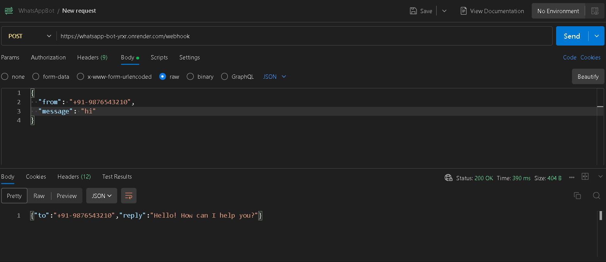
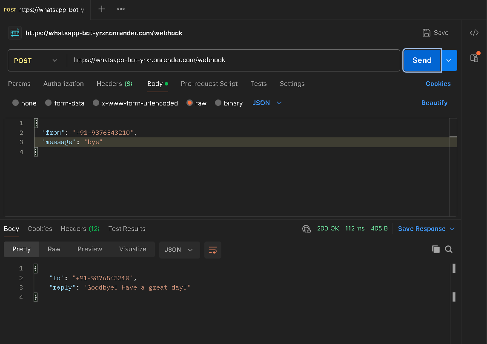
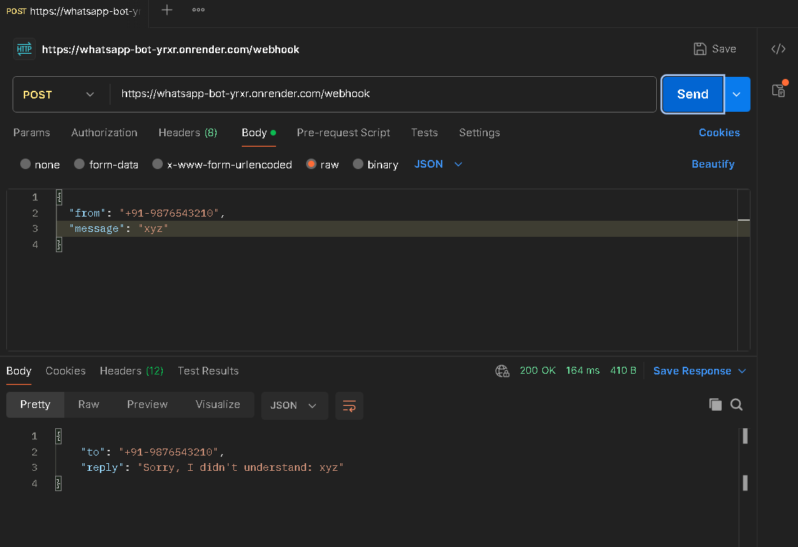

# WhatsApp Chatbot Backend Simulation

A simple WhatsApp chatbot backend simulation built using Java and Spring Boot.
It exposes a REST API endpoint that accepts JSON messages and returns predefined replies.

---

## Tech Stack

- Java 17
- Spring Boot 3.2
- Maven
- SLF4J (Logging)
- Deployed on Render

---

## Project Structure
```
src/main/java/com/example/whatsappbot/
├── WhatsappBotApplication.java
├── controller/
│   └── WebhookController.java
├── model/
│   ├── WhatsAppMessage.java
│   └── WhatsAppResponse.java
└── service/
    └── ChatbotService.java
```

---

## How It Works

- Client sends a POST request to `/webhook` with a JSON body
- The controller receives the request and passes it to the service
- The service logs the message and returns a predefined reply
- Response is sent back as JSON

---

## Predefined Replies

| Message        | Reply                        |
|----------------|------------------------------|
| Hi / hello     | Hello! How can I help you?   |
| Bye / goodbye  | Goodbye! Have a great day!   |
| Anything else  | Sorry, I didn't understand   |

---

## API Endpoints

### POST /webhook
Receives a WhatsApp message and returns a reply.

**Request Body:**
```json
{
  "from": "+91-9876543210",
  "message": "Hi"
}
```

**Response:**
```json
{
  "to": "+91-9876543210",
  "reply": "Hello! How can I help you?"
}
```

---

### GET /health
Check if the server is running.

**Response:**
```
WhatsApp Bot is running!
```

---

## Run Locally

### Prerequisites
- Java 17 or higher
- Maven

### Steps

1. Clone the repository
```bash
git clone https://github.com/YOUR_USERNAME/whatsapp-bot.git
cd whatsapp-bot
```

2. Run the application
```bash
./mvnw spring-boot:run
```

3. Server starts at
```
http://localhost:8080
```

---

## Test with Postman

1. Open Postman
2. Set method to **POST**
3. Enter URL: `http://localhost:8080/webhook`
4. Go to **Body → raw → JSON**
5. Paste the request body and click **Send**

---

## Live Demo

Deployed on Render:  
**https://whatsapp-bot-yrxr.onrender.com**

Test it:
```bash
POST https://whatsapp-bot-yrxr.onrender.com/webhook
```

> Note: Free tier on Render may take 30–60 seconds to wake up on first request.

---

## Logging

All incoming messages and replies are logged to the console using SLF4J.

Example log output:
```
INFO  ChatbotService - Received message from [+91-9876543210]: Hi
INFO  ChatbotService - Sending reply to [+91-9876543210]: Hello! How can I help you?
```

---

## Screenshots

### Postman - Hi Request


### Postman - Bye Request


### Console Logs


---

## Author

Jhaveri Tirtha
[GitHub](https://github.com/02Tirtha)
